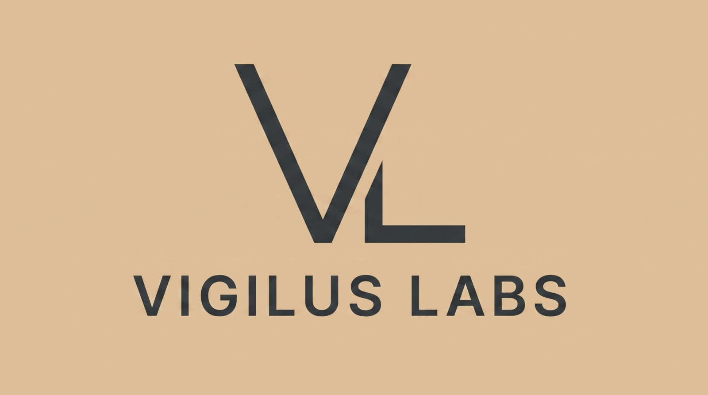

<!--
  Org profile README — renders on https://github.com/vigilus-labs
  Branding lives in ./assets (banner.png + logo.png). To swap the hero, change
  the  tag below.
-->
<div align="center">

<a href="https://vigilus.dev">
  
</a>

**Self-hosted, AI-powered homelab operations platform.**

One deployable app: a React dashboard, a conversational AI orchestrator, an MCP
server manager, and a user-definable agent ("Operator") system.

<p>
  <a href="https://vigilus.dev"><strong>🌐 vigilus.dev</strong></a>
  &nbsp;·&nbsp;
  <a href="https://github.com/vigilus-labs/vigilus"><strong>📦 Source code</strong></a>
  &nbsp;·&nbsp;
  <a href="https://github.com/vigilus-labs/vigilus#readme"><strong>📖 Docs</strong></a>
</p>

<p>
  <a href="https://vigilus.dev"></a>
  <a href="https://github.com/vigilus-labs/vigilus/blob/main/LICENSE"></a>
  <a href="https://www.python.org/downloads/"></a>
  <a href="https://nodejs.org/"></a>
  <a href="https://modelcontextprotocol.io"></a>
  
</p>

</div>

---

Vigilus runs your homelab like a single team. Chat with the **orchestrator**,
which routes work to specialist **Operators** — each with its own model, tools,
and permission ceiling. Operators reach your infrastructure through native
shell/SSH/Docker tools, HTTP APIs, or any **Model Context Protocol** server you
register. Every action is policy-checked, audit-logged, and secrets are
encrypted at rest.

Built for people who want the power of agentic AI on their own hardware,
without handing their infrastructure to a third party.

## ✨ Features

| | |
| :--- | :--- |
| 🤖 **Conversational orchestration** | The Vigilus orchestrator routes each request to the right specialist Operator. |
| 🧩 **User-defined Operators** | Create sub-agents with custom prompts, models, tools, working directories, and permission levels. |
| 🔌 **MCP server management** | Register, start/stop, and auto-discover tools from any MCP server. |
| 🔐 **RBAC + Just-In-Time access** | `read → write → exec → elevate` permission ceilings, with JIT elevation that pauses for human approval. |
| 📋 **Full audit trail** | Append-only, secret-redacted action history with export. |
| ⏰ **Scheduled tasks** | Cron-based recurring runs, each producing a reviewable chat session. |
| 🗄️ **Server inventory** | Manage hosts with encrypted SSH credentials and connectivity testing. |
| 🧠 **Multi-provider LLMs** | Anthropic, OpenAI, Google, Ollama, LM Studio, vLLM, OpenRouter, xAI — any OpenAI-compatible endpoint. |
| 📡 **Real-time dashboard** | WebSocket-driven live updates across the entire UI. |
| 💬 **Telegram & Discord** | Reach Vigilus from chat platforms (default-deny access, encrypted tokens). |

## 🚀 Quick start

```bash
git clone https://github.com/vigilus-labs/vigilus.git
cd vigilus/backend

pip install -e ".[dev]"
export VIGILUS_SECRET="$(openssl rand -hex 32)"
vigilus init
vigilus start
```

Then open **http://localhost:8000**.

Prefer containers? There's a `docker-compose.yml` in the repo. Full options
(including PostgreSQL, search backends, channels) are in the
[main repo README](https://github.com/vigilus-labs/vigilus#readme).

## 🏛️ Architecture

```
┌─────────────────────────────────────────────────┐
│                   Frontend (React)               │
│  Dashboard │ Chat │ Operators │ MCP │ JIT │ …    │
├─────────────────────────────────────────────────┤
│              WebSocket + REST API                │
├─────────────────────────────────────────────────┤
│                 Vigilus Orchestrator              │
│        ┌─────────┬──────────┬──────────┐        │
│        │Operator A│Operator B│Operator C│        │
│        └────┬────┴────┬─────┴────┬─────┘        │
│     ┌───────┴─────────┴──────────┴────────┐     │
│     │          Tool Registry (RBAC)        │     │
│     ├──────┬──────────┬───────────────────┤     │
│     │Native│   HTTP   │       MCP         │     │
│     │Tools │  Tools   │      Tools        │     │
│     └──┬───┴────┬─────┴────┬──────────────┘     │
│   SSH/Docker  APIs    MCP Servers               │
├─────────────────────────────────────────────────┤
│  Audit Log │ JIT Warden │ Crypto │ Event Bus    │
├─────────────────────────────────────────────────┤
│              SQLite / PostgreSQL                 │
└─────────────────────────────────────────────────┘
```

## 🛡️ Security first

Vigilus runs LLM-driven tools against real infrastructure, so the policy path is
non-negotiable:

- **Every** tool call flows through the RBAC policy engine — no bypass paths.
- Permission levels are **hard ceilings**; JIT is the *only* elevation path.
- JIT tokens are **HMAC-signed, short-lived, and resource-scoped**.
- All secrets encrypted at rest via **Fernet (AES)**.
- **Append-only** audit log with automatic secret redaction.
- SSH host keys verified **trust-on-first-use** (pinned to `data/known_hosts`).
- Host filesystem tools confined to an Operator's working directory, with
  symlink and path-traversal protections.
- CORS locked to configured origins; **fail-closed** on any policy error.

## 🔗 Links

- **Website / demo** — [vigilus.dev](https://vigilus.dev)
- **Source** — [github.com/vigilus-labs/vigilus](https://github.com/vigilus-labs/vigilus)
- **Docs** — [main README](https://github.com/vigilus-labs/vigilus#readme)
- **Report an issue** — [github.com/vigilus-labs/vigilus/issues](https://github.com/vigilus-labs/vigilus/issues)

## 📄 License

Vigilus is open source under the **MIT License**.

<div align="center">
<sub>Built by <a href="https://github.com/vigilus-labs">Vigilus Labs</a> · Self-hosted, by design.</sub>
</div>
